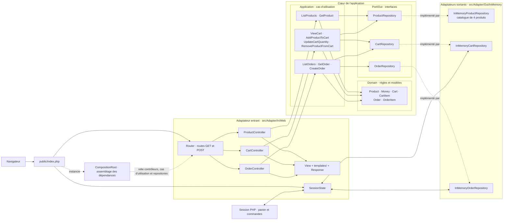

# MiniShop

Mini e-commerce pédagogique en **PHP pur**, sans framework, sans ORM et sans SQL.
Prérequis : PHP **8.3+**, Composer. Aucune dépendance externe.

```bash
cd mini-shop
composer dump-autoload
composer test
php -S localhost:8000 -t public
```

Ouvrir http://localhost:8000. Le serveur PHP de développement est destiné au TP.

## Architecture

- **Domain** : produits, montants en centimes, panier et commandes ; validation et calculs métier.
- **Application** : neuf cas d'utilisation indépendants de HTTP et de la persistance concrète ; méthode `execute()`.
- **Port/Out** : interfaces ProductRepository, CartRepository et OrderRepository. Les classes Application exposent directement les opérations d'entrée ; aucun port d'entrée supplémentaire n'est nécessaire ici.
- **Adapter/Out/InMemory** : repositories en mémoire, catalogue fixe de quatre produits. Le repository panier copie l'état pour que les modifications soient explicites via `save()`.
- **Adapter/In/Web** : contrôleurs, routes, validation HTTP, réponses, rendu HTML et pont de session. Les erreurs métier deviennent des réponses 400 ; les produits et commandes absents des réponses 404. Les formulaires POST redirigent en 303.
- **Composition Root** : `src/CompositionRoot.php` instancie les repositories, les cas d'utilisation et les contrôleurs. `public/index.php` démarre la session, appelle le routeur et envoie la réponse.



Les flèches pleines montrent les appels et les échanges d'état. Les flèches pointillées montrent l'implémentation des ports et l'assemblage par `CompositionRoot` ; les interfaces du cœur ne dépendent pas des classes `InMemory`. Les contrôleurs appellent directement `execute()` : il n'y a pas d'interface de port entrant distincte dans ce projet.

## InMemory et HTTP

Les objets InMemory sont recréés à chaque requête. Le catalogue est fixe. `SessionState`, dans l'adapter Web, réhydrate panier et commandes depuis la session PHP, puis sauvegarde leurs instantanés après le traitement. PHP sérialise ces objets dans la session ; l'autoload est chargé avant `session_start()`. Domain et Application ne connaissent jamais `$_SESSION`. Les commandes sont propres à la session du navigateur ; un autre navigateur possède un autre panier et un autre historique. Ce pont de session rend le TP utilisable entre les requêtes sans repository SQL.

## Routes

| Méthode | Chemin | Action |
| --- | --- | --- |
| GET | `/`, `/products` | Catalogue |
| GET | `/products/{id}` | Détail produit |
| GET | `/cart` | Panier |
| POST | `/cart/add` | Ajouter (`productId`, `quantity`) |
| POST | `/cart/update` | Modifier (`productId`, `quantity`) |
| POST | `/cart/remove` | Supprimer (`productId`) |
| POST | `/orders` | Commander |
| GET | `/orders` | Historique |
| GET | `/orders/{id}` | Détail commande |

## Validation

`composer test` lance les tests sans bibliothèque externe : domaine, repositories, cas d'utilisation, paramètres HTTP, échappement HTML, vues, routes et réhydratation. Le parcours final ajoute deux claviers et une souris, passe à trois claviers, vérifie **276,00 €**, commande, puis vérifie le panier vide et le détail de la commande.

```bash
find src public tests templates -name '*.php' -print0 | xargs -0 -n1 php -l
php tests/http-workflow.php
```

Le dernier test nécessite le serveur démarré à localhost:8000. Il utilise une nouvelle session et couvre les requêtes HTTP successives, les redirections et les erreurs.

L'environnement de réalisation fournit PHP 8.2.33. Les vérifications locales ont utilisé `composer dump-autoload --ignore-platform-req=php` pour générer temporairement l'autoload ; le prérequis du projet reste PHP 8.3+. La validation sous PHP 8.3+ reste à effectuer.

## Questions pédagogiques

**Que modifier pour remplacer HTML par une API JSON ?** Ajouter ou remplacer un Input Adapter.

**Que modifier pour remplacer InMemory par SQL ?** Ajouter des Output Adapters implémentant les mêmes ports.

Domain et Application restent inchangés dans les deux cas.

## Progression Git

| Tag | Fichiers et contenu | Vérification |
| --- | --- | --- |
| step-01 | Composer, point d'entrée, README, gitignore | Autoload et syntaxe PHP |
| step-02 | Six classes Domain et lanceur de tests | Instanciation et montants |
| step-03 | Règles Domain et tests | Quantités, panier, commande vide |
| step-04 | Trois ports de sortie | Tests existants et syntaxe |
| step-05 | Trois adapters InMemory et tests | Recherche, sauvegarde, isolation |
| step-06 | Neuf cas d'utilisation, NotFound et tests | Parcours métier |
| step-07 | Contrôleurs, routeur, Input, Response, View | Paramètres et redirection |
| step-08 | Six templates HTML et tests | Rendu et échappement |
| step-09 | CompositionRoot, SessionState, point d'entrée, documentation et tests | Suite complète, HTTP et syntaxe |

Chaque étape possède son commit dédié et son tag. Aucun push distant.
